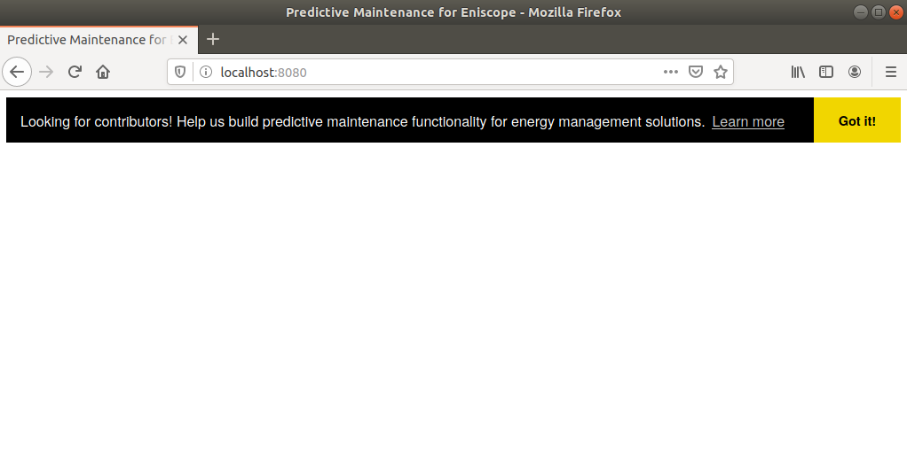
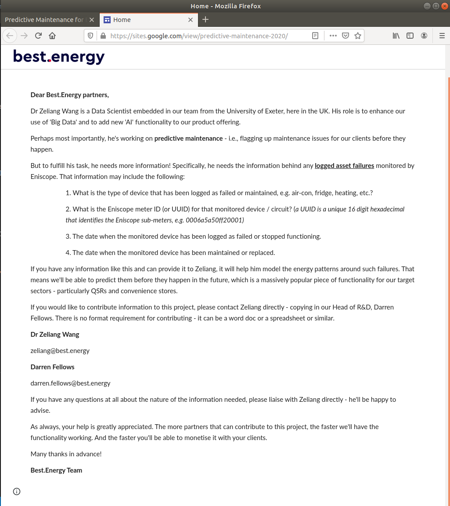

## Cookie consent widget 

***

This is a cookie consent used for collecting maintenance records from Best.Energy partners in order to build predictive maintenance functionality for energy management solutions. Read [this post](https://sites.google.com/view/predictive-maintenance-2020/) for more details.

### Dependencies
***

> Install NPM

```bash
sudo apt update
sudo apt install npm
```

> To build and serve the app to browser, we'll need WebPack packages

```bash
npm install webpack webpack-dev-server copy-webpack-plugin --save-dev
```

### Build and Serve
***

```bash
./node_modules/.bin/webpack --config webpack.config.js
./node_modules/.bin/webpack-dev-server --open
```

### Build release
***

```bash
./node_modules/.bin/webpack --config webpack.config.js --env.prod
```

### Screenshots
***




### References
***

- https://blog.jenyay.com/building-javascript-widget/
- https://github.com/osano/cookieconsent
- https://www.osano.com/cookieconsent/download/
